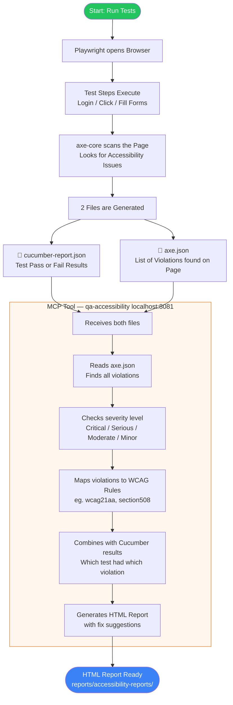

# qa-accessibility MCP Tool — Flow Diagram

```mermaid
flowchart TD
    A([Start: Run Tests]) --> B[Playwright opens Browser]
    B --> C[Test Steps Execute\nLogin / Click / Fill Forms]
    C --> D[axe-core scans the Page\nLooks for Accessibility Issues]
    D --> E[2 Files are Generated]

    E --> F[📄 cucumber-report.json\nTest Pass or Fail Results]
    E --> G[📄 axe.json\nList of Violations found on Page]

    F --> H
    G --> H

    subgraph MCP["MCP Tool — qa-accessibility  localhost:8081"]
        H[Receives both files]
        H --> I[Reads axe.json\nFinds all violations]
        I --> J[Checks severity level\nCritical / Serious / Moderate / Minor]
        J --> K[Maps violations to WCAG Rules\neg. wcag21aa, section508]
        K --> L[Combines with Cucumber results\nWhich test had which violation]
        L --> M[Generates HTML Report\nwith fix suggestions]
    end

    M --> N([HTML Report Ready\nreports/accessibility-reports/])

    style A fill:#22c55e,color:#fff
    style N fill:#3b82f6,color:#fff
    style MCP fill:#fff7ed,stroke:#f97316
```
